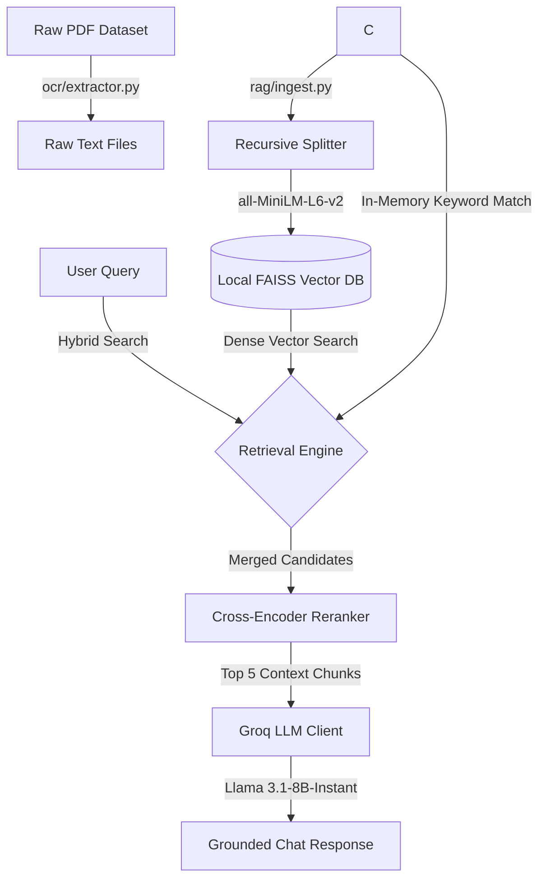

# SAP Knowledge Assistant (SAP Bot)

A high-precision, cost-effective Retrieval-Augmented Generation (RAG) chatbot designed to answer questions on **SAP Materials Management (MM)**, **SAP Sales and Distribution (SD)**, and **SAP S/4HANA** processes. The system runs local sentence embedding and Cross-Encoder re-ranking models on your CPU for free, combined with Groq's API for low-latency, strictly grounded LLM completions.

---

## Research & Data Sourcing

This chatbot's knowledge base is built upon targeted research to collect, compile, and structure scattered SAP documentation. 

Valuable PDF guides, transaction tables, and technical reference materials were sourced from:
*   **SAP Help Portal (`help.sap.com`)**: Official product documentation, configuration paths, and structural guides for S/4HANA releases.
*   **SAP Learning Hub (`learning.sap.com`)**: Reference sheets and core course descriptions for MM (Materials Management) and SD (Sales and Distribution) modules.
*   **SAP Community Forums (`community.sap.com`)**: Real-world troubleshooting guides, transaction code (T-code) use-cases, and common configurations.
*   **GitHub Repositories**: Sourced open SAP dictionaries, BAPI lists, and community-compiled schema cheat-sheets.

Once collected, this raw dataset underwent custom programmatic extraction and cleaning pipelines to make it RAG-ready.

---

## RAG Pipeline Architecture

Below is the workflow showing how raw PDFs are processed into searchable vectors, retrieved using hybrid search, and resolved into grounded answers:



---

## Step-by-Step Pipeline Explanation

### 1. Document Extraction (`backend/ocr/extractor.py`)
*   **Action**: Iterates through raw PDFs stored in `data/` and extracts text page-by-page.
*   **Accuracy Guard**: Utilizes standard PyMuPDF text extraction with automated layout boundary fallbacks to preserve tables and columns.
*   **Output**: Saved as raw text files in `data/text files/`.

### 2. RAG-Ready Text Cleaning (`backend/ocr/cleaner.py`)
*   **Action**: Strips repetitive web page noise, browser headers/footers, date stamps, disclaimers, likes/comments count, and URL queries.
*   **Metadata Injection**: Injects page-level structured tracking headers (e.g. `# [Source: filename.pdf | Page: 3 | Module: SD]`) at the top of each page, enabling precise inline source citations in chat responses.

### 3. Database Ingestion & Recursive Chunking (`backend/rag/ingest.py`)
*   **Action**: Splits cleaned text pages into smaller, balanced chunks.
*   **Size Guard**: Uses `RecursiveCharacterTextSplitter` to bound chunks to a maximum of `1,500` characters (with `150` characters overlap). This resolves Groq's 6,000 Tokens Per Minute (TPM) limit by keeping RAG requests small and focused.
*   **Vector DB**: Computes embeddings locally using the HuggingFace `all-MiniLM-L6-v2` model and stores the index in a local **FAISS database** (`data/faiss_index/`).

### 4. Hybrid Search Retrieval & Local Re-ranking (`backend/rag/retiever.py`)
When a user asks a question, the retrieval engine does the following:
*   **Dense Vector Search**: Queries FAISS (k=12) to match the semantic meaning of the question.
*   **Exact Keyword Matching**: Scans the docstore for exact word-boundary matches of SAP tables (e.g., `MARA`, `VBAK`), transaction codes, and specific BAPIs. This prevents dense retrieval models from missing short acronyms.
*   **Local Re-ranking**: Combines and deduplicates candidates, then scores them using a local Cross-Encoder model (`cross-encoder/ms-marco-MiniLM-L-6-v2`). Chunks scoring below `-9.5` are rejected. The top 5 highest-ranked chunks are passed to the LLM.

### 5. Grounded Generation & Citations
*   **LLM Model**: Groq's `llama-3.1-8b-instant` (low latency, high instruction adherence).
*   **Anti-Hallucination Guard**: The system prompt strictly limits the LLM's scope to the provided context. If the query cannot be answered using the top 5 chunks, the bot responds with exactly: *"I am sorry, but I cannot find this information in the provided resources."*
*   **Citations**: The bot includes inline page citations (e.g., `[BAPI's List.txt, Page: 1]`) matching the source headers in the database chunks.

---

## File Directory Structure

```text
SAP-Chatbot/
├── backend/
│   ├── ocr/
│   │   ├── extractor.py       # Extracts raw text from PDFs
│   │   └── cleaner.py         # Cleans text & embeds source/page tracking
│   ├── rag/
│   │   ├── ingest.py          # Splits text & builds local FAISS index
│   │   └── retiever.py        # Hybrid Search, Reranking & Groq Completion
│   └── main.py                # FastAPI endpoints (/chat & /health)
├── frontend/
│   ├── index.html             # Clean, minimal UI
│   ├── style.css              # Soft light theme layout
│   └── script.js              # State management & chat communications
├── data/
│   ├── text files/            # Cleaned text files ready for vectorization
│   └── faiss_index/           # Serialized local FAISS database
├── .env                       # Local environment configurations (API Keys)
├── requirements.txt           # Project Python dependencies
└── README.md                  # Project Documentation
```

---

## Setup & Execution Guide

### Prerequisites
*   Python 3.11 or 3.13 (recommended virtual environment).
*   A **Groq API Key** (register at [groq.com](https://groq.com) to get a free API key).

### Step 1: Environment Setup
1.  Clone or open this repository in your project folder.
2.  Create a file named `.env` in the root folder:
    ```env
    GROQ_API_KEY=your_actual_groq_api_key_here
    ```

### Step 2: Install Dependencies
Activate your virtual environment and install the required packages:
```bash
pip install -r requirements.txt
```

### Step 3: Parse and Ingest Data
Compute text embeddings and build the vector database:
```bash
python backend/rag/ingest.py
```
*(This scans `data/text files/` and builds the FAISS store inside `data/faiss_index/`)*

### Step 4: Run the Backend Server
Start the FastAPI server on port 8000:
```bash
uvicorn backend.main:app --reload --port 8000
```
*(Verify it started successfully; the health check will output `INFO 127.0.0.1:xxxx - "GET /health ... 200 OK"`)*

### Step 5: Start the Chatbot
Open the `frontend/index.html` file in any web browser. You can now chat with the bot in a clean, distraction-free light UI!
